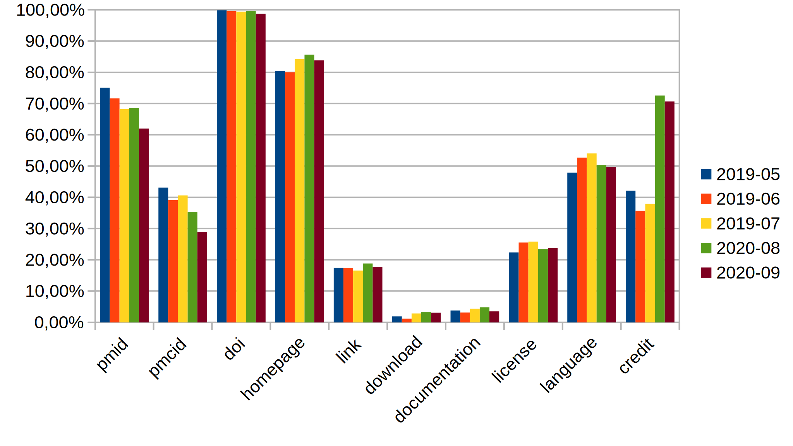

.. _output:

######
Output
######

All results and intermediate files will be output to the `output directory`_ specified by the user. The main results files of interest are `results.csv`_, where all results with all possible extra data are output, `diff.csv`_, where potential fixes to some `bio.tools <https://bio.tools>`_ content is output (based on differences of new entries and corresponding entries already :ref:`existing in bio.tools <usage_existing>`), and `to_biotools.json`_, where new additions to bio.tools are output. All intermediate files are also copied and kept in the output directory for potential reproducibility and debugging purposes.

The output of Pub2Tools does not lead to fully automatic growth and improvement of bio.tools content. The results have to be curated: filled attributes might need checking or editing (especially description_), some suggested entries might actually not be tools or otherwise not be suitable for bio.tools, information for many attributes is not found (as seen in performance_), fixes in ``diff.csv`` have to be checked and applied manually, etc.

.. _output_directory:

****************
Output directory
****************

The name of the output directory is chosen by the user and must be specified after all commands, like ``-copy-edam directory_name`` or ``-pass1 directory_name``. In case the output directory is not existing, it will be created. And while the name of the output directory can be chosen, the names of the results and intermediate files are fixed. Short descriptions of these files is given below.

.. _pub2tools_log:

pub2tools.log
=============

The log file is created to a new output directory by the first command that is run with the output directory as argument. The first two lines of the log file are the arguments given to Pub2Tools and the version of Pub2Tools. Then, the same lines that are output to the console while the command is running, are output to the log file, except also all ``DEBUG`` level messages are output and all log messages coming from `PubFetcher <https://github.com/edamontology/pubfetcher>`_ and `EDAMmap <https://github.com/edamontology/edammap>`_ code are output to the log file (outputting those to the console is turned off by default with the :ref:`parameter <parameters>` ``--verbose OFF``). Any subsequent commands run on the output directory will just append to the existing log file.

The log file could later be used for debugging. One option would be analysing ``ERROR`` level messages, for example with ``grep ERROR pub2tools.log | less``. More information about the structure of a log line and analysing the logs can be found in the PubFetcher documentation about the `log file <https://pubfetcher.readthedocs.io/en/latest/output.html#log-file>`_.

.. _edam_owl:

EDAM.owl
========

The `EDAM ontology <http://edamontology.org/page>`_ file is needed by the :ref:`map` step to add EDAM terms to the results. It can be downloaded from the `EDAM ontology GitHub <https://github.com/edamontology/edamontology>`_ and copied to the output directory with the setup command :ref:`copy_edam`.

.. _tf_idf:

tf.idf
======

A simple file of tab-separated values containing normalised `tf–idf <https://en.wikipedia.org/wiki/Tf%E2%80%93idf>`_ scores of (unstemmed) words occuring in the `bio.tools <https://bio.tools>`_ corpus. It can either be downloaded or generated, more information at :ref:`copy_idf`, which is the command used to copy the file to the output directory.

.. note::
  As the IDF files are one of the largest files in the output directory and these files are potentially equal across many runs of Pub2Tools, then these could be the files to delete first in a finalised output directory to save disk space (or linked to some master IDF files with ``ln -s``).

.. _tf_stemmed_idf:

tf.stemmed.idf
==============

Like `tf.idf`_, except the words are stemmed.

.. _biotools_json:

biotools.json
=============

The entire content of `bio.tools`_ in JSON format and adhering to `biotoolsSchema <https://biotoolsschema.readthedocs.io/>`_, either downloaded with :ref:`get_biotools` or copied with :ref:`copy_biotools`.

.. _pub_txt:

pub.txt
=======

A list of candidate publication IDs to search tools from. It's a simple text file containing publication IDs in the form ``<pmid>\t<pmcid>\t<doi>``, one per line. Empty lines and lines beginning with ``#`` are ignored. It can be either fetched with :ref:`select_pub` or copied with :ref:`copy_pub` or created manually.

.. _db_db:

db.db
=====

A `PubFetcher database <https://pubfetcher.readthedocs.io/en/latest/output.html#database>`_ file containing the contents of publications and web pages fetched as part of a Pub2Tools run. It needs to be initialised with :ref:`init_db` or a database with prefetched content can be copied with :ref:`copy_db`. The database can be queried or manipulated with `PubFetcher-CLI <https://pubfetcher.readthedocs.io/en/latest/cli.html>`_ or `EDAMmap-Util <https://edammap.readthedocs.io/en/latest/manual.html#edammap-util>`_.

.. _step_txt:

step.txt
========

Used to keep track of the current :ref:`step <steps>` being run. Can contain the value ``None``, ``-fetch-pub``, ``-pass1``, ``-fetch-web``, ``-pass2``, ``-map`` or ``Done``. The value indicates, which step should be run next. So for example, after :ref:`-pass1 <pass1>` completes successfully, the value ``-fetch-web`` will be written to the file. If the file is present and contains any value other than ``None``, then this means that some steps have been run and no :ref:`setup_commands` can be run anymore. But the main use of the file is enabling the :ref:`resume` command: when that command is run it checks which step should be run next and runs that step and all subsequent steps until the last step of :ref:`-map <map>` is completed and ``Done`` is written out.

.. _web_txt:

web.txt
=======

A list of webpage URLs extracted from the publication abstracts and fulltexts by the :ref:`pass1` command that are matching the (up to 5 per publication) names suggested for the tools the publications are potentially about. These URLs are candidates for the tool homepage and other link attributes in bio.tools and the content of these links needs to be fetched in :ref:`fetch_web`. The URLs are simply written one per line, with empty lines and lines beginning with ``#`` being ignored.

.. _doc_txt:

doc.txt
=======

Same as `web.txt`_, except links determined to be about documentation are written here instead (because the `PubFetcher database`_ has a separate store for docs).

.. _pass1_json:

pass1.json
==========

Results of the :ref:`pass1` command, that are later used as input for :ref:`pass2`. The results include information about the publication (like its IDs, title, publication date and journal, number of citation and corresponding authors) and about the up to 5 candidate names for the potential tool the publication is about (including the name in processed form, the score assigned to the name and links attached to it). Most of the values passed on to :ref:`pass2` also end up in `results.csv`_, so more thorough documentation about these values can be found in `results.csv columns`_.

.. _results_csv:

results.csv
===========

This file will contain all results of Pub2Tools as output by the :ref:`pass2` command, including entries that were excluded for entry to bio.tools or found to be already existing there. In addition to the end results that can be inserted to bio.tools attributes, each entry will contain all possible other data related to the entry and values of intermediate results, but also values currently present in bio.tools for entries that were found to be existing there. All these values are documented in `results.csv columns`_. The first row of the file specifies the column names and the second row contains links to the column documentations in `results.csv columns`_.

.. _diff_csv:

diff.csv
========

This file will contain entries that were found to be :ref:`existing in bio.tools <usage_existing>` in :ref:`pass2`. More precisely, it will only contain entries, that were found to be existing in bio.tools and for which some value was found to be different or missing in bio.tools, and the contents of the file will be a listing of these difference (i.e. differing or missing values). Many of these differences are mistakes made by Pub2Tools, but many are also pointing to incorrect or missing information in bio.tools, thus the contents of this file can be used to improve existing entries of bio.tools. In rare circumstances, some entries that are not actually already existing in bio.tools might be mistakenly diverted here (instead of `to_biotools.json`_) -- such entries should be added to bio.tools manually. This file can be especially useful if Pub2Tools is run on all publications currently in bio.tools, like exemplified in :ref:`improving_existing`. The structure of the file is documented in `diff.csv columns`_. The first row of the file specifies the column names and the second row contains links to the column documentations in `diff.csv columns`_.

.. _new_json:

new.json
========

This file will contain all new entries suggested for addition to bio.tools, as :ref:`decided <final_decision>` and output by :ref:`pass2` and adhering to biotoolsSchema_. The file is fed as input to the command :ref:`map`, producing `to_biotools.json`_, which is the file that should actually be used to add the new entries to bio.tools.

The following bio.tools attributes will always be filled: `name attribute <https://biotools.readthedocs.io/en/latest/curators_guide.html#name-tool>`_, `description attribute <https://biotools.readthedocs.io/en/latest/curators_guide.html#description>`_ (if nothing else is found, then it is filled with the publication abstract), `homepage attribute <https://biotools.readthedocs.io/en/latest/curators_guide.html#homepage>`_ (if no links found, then filled with a link to the publication itself) and `publication attribute <https://biotools.readthedocs.io/en/latest/curators_guide.html#publication-group>`_. Additionally, an effort is made to fill the following attributes: `language attribute <https://biotools.readthedocs.io/en/latest/curators_guide.html#programming-language>`_, `license attribute <https://biotools.readthedocs.io/en/latest/curators_guide.html#license>`_, `link attribute <https://biotools.readthedocs.io/en/latest/curators_guide.html#link-group>`_, `download attribute <https://biotools.readthedocs.io/en/latest/curators_guide.html#download-group>`_, `documentation attribute <https://biotools.readthedocs.io/en/latest/curators_guide.html#documentation-group>`_ and `credit attribute <https://biotools.readthedocs.io/en/latest/curators_guide.html#credit-group>`_. Further information about possible values of these attributes (for example about the messages to the curator in the description_) can be found in `to_biotools.json attributes`_.

.. _map_txt:

map.txt
=======

Additional data about the `EDAMmap results <https://edammap.readthedocs.io/en/latest/manual.html#results>`_ got using the :ref:`map` command, in plain text format.

.. _map_dir:

map/
====

Additional data about the `EDAMmap results <https://edammap.readthedocs.io/en/latest/manual.html#results>`_ got using the :ref:`map` command, in a directory of HTML files. To see this mapping data, open ``map/index.html`` in a web browser.

.. _map_json:

map.json
========

Additional data about the `EDAMmap results <https://edammap.readthedocs.io/en/latest/manual.html#results>`_ got using the :ref:`map` command, in JSON format.

.. _to_biotools_json:

to_biotools.json
================

Same as `new.json`_, except EDAMmap terms have been added by the :ref:`map` command to the `function attribute <https://biotools.readthedocs.io/en/latest/curators_guide.html#function-group>`_ and `topic attribute <https://biotools.readthedocs.io/en/latest/curators_guide.html#topic>`_. This is the file that should be used to add new entries to bio.tools. Rarely, some entries here are actually already existing in bio.tools (and thus should have been output to `diff.csv`_ instead) -- such entries should evidently not be added to bio.tools (however, such entries might still contain useful information on what to change in those existing entries). Further information about possible values of the attributes can be found in `to_biotools.json attributes`_.

.. _results_csv_columns:

**********************
`results.csv`_ columns
**********************

_`pmid`
  As results are extracted from publications, then the first 3 columns are the IDs of the publication -- here, the PubMed ID of the publication is output. These `publication IDs <https://pubfetcher.readthedocs.io/en/latest/output.html#ids-of-publications>`_ are used to fill the `publication attribute`_ of bio.tools. Sometimes, multiple publications seem to be about the same tool -- in that case the corresponding results are :ref:`merged into one row <merge_same_suggestions>` and the PubMed IDs of these different publications will be separated by ``" | "`` here.
_`pmcid`
  Like pmid_, but for the PubMed Central ID of publications.
_`doi`
  Like pmid_, but for the Digital Object Identifier (DOI) of publications.

  .. _same_suggestions:
same_suggestions
  Currently, results got from two different publications are :ref:`merged into one result <merge_same_suggestions>`, if their top name suggestion_ is exactly equal and confidence_ is not "very low". If the names are equal, but confidence of at least one of the names is "very low", then the publications are not merged, but instead linked through this column (where one result will contain publication IDs of the other result and vice versa). If multiple such links are made, then the publication IDs of the different linked results are separated by ``" | "``.

  .. _score:
score
  The goodness score of the suggestion_ is calculated in the first pass (:ref:`pass1`) and shows confidence_ in the extracted tool name (and not in how "good" or high impact the tool itself is). Entries in the results file are sorted by score (for entries whose score is at least 1000), but there are a few other things to consider in assessing whether an entry is about a tool and suitable for suggestion to bio.tools -- whether an entry is suggested can be seen in the include_ column.

  .. _score2:
score2
  If score_ is lower than 1000, then this :ref:`second score is calculated <usage_score2>` in the second pass (:ref:`pass2`) for further fine-tuning of entries of lower confidence. Entries that have this second score are sorted by it instead of score_.
_`score2_parts`
  Values of the :ref:`four parts <score2-parts>` of score2_. Summing these four parts, plus the value of score_, will get as result score2_.
_`confidence`
  A confidence of "high", "medium", "low" or "very low" :ref:`is determined <usage_confidence>` based on the values of score_ and score2_.

  .. _include:
include
  ``true``, if the :ref:`final decision <final_decision>` of Pub2Tools, based on some additional aspects in addition to score_ and score2_, is that the entry is about a tool. In the ``true`` case, the entry will be suggested as a new tool to add to bio.tools, unless the value in the existing_ column is not empty. Also, if confidence_ is "very low", but include_ is still ``true``, then the entry is quite possibly about a tool and suggested for entry, however, the confidence in the tool name suggestion_ is very low and should be checked.
_`existing`
  Will contain `bio.tools ID(s) <https://biotools.readthedocs.io/en/latest/api_usage_guide.html#biotoolsid>`_ of entries that are found to be already :ref:`existing in bio.tools <usage_existing>`. If multiple entries in bio.tools are matched, then the IDs are separated by ``" | "``. Entries that are found to be already existing in bio.tools are not suggested as new tools, however, if there are differences in information currently in bio.tools and information extracted by Pub2Tools for these entries, then these differences are highlighted in `diff.csv`_ (and for entries that were found to be existing due to matching publication IDs in bio.tools, entry to `diff.csv`_ is done even if include_ is ``false``).
_`suggestion_original`
  The name suggested for the tool, in original form as extracted from the title and abstract of the publication. As there are syntactic restrictions and a limited set of characters allowed in the name (latin letters, numbers and some punctuation symbols, as seen in `name attribute API docs <https://biotools.readthedocs.io/en/latest/api_usage_guide.html#name>`_), then for some entries the original suggestion must be edited: invalid characters are either replaced (done for accents, greek letters, etc) or discarded altogether and too long suggestions truncated. Only syntactic rules mandated by biotoolsSchema_ are followed, curation guidelines for the `name attribute`_ are not necessarily followed. The value in this column will be empty, if no such modifications need to be made, otherwise this column will contain the original name and the suggestion_ column the modified form of the name.

  .. _suggestion:
suggestion
  The name suggested as the `name attribute`_ of the tool for bio.tools, extracted from the title and abstract of the publication in the first pass (:ref:`pass1`).
_`suggestion_processed`
  A further processed version of suggestion_ (with letters converted to lowercase and symbols removed), used in many parts of the Pub2Tools algorithm (like matching the name to extracted links).
_`publication_and_name_existing`
  Contains bio.tools IDs (separated by ``" | "``) of entries in bio.tools that have exactly the same name and whose publications are also present in this entry constructed by Pub2Tools. Matching publication IDs mean that the entry is considered :ref:`existing in bio.tools <usage_existing>` and it is added to the existing_ column (even if include_ is ``false``).
_`name_existing_some_publication_different`
  Contains bio.tools IDs (separated by ``" | "``) of entries in bio.tools that have exactly the same name and for which some publications are also present in this entry constructed by Pub2Tools, but some are not (IDs of publications found by Pub2Tools but not present in bio.tools are written in parenthesis after the bio.tools ID, with possible multiple publications separated by ``" ; "``). Some matching publication IDs mean that the entry is considered :ref:`existing in bio.tools <usage_existing>` and it is added to the existing_ column (even if include_ is ``false``).
_`some_publication_existing_name_different`
  Contains bio.tools IDs (separated by ``" | "``) of entries in bio.tools whose publications are also present in this entry constructed by Pub2Tools, but whose name is different than the name found by Pub2Tools (the tool name of the entry in bio.tools is written in parenthesis after the ID; in addition, if Pub2Tools has found publications that are not present in the matching bio.tools entry, then the IDs of these publications are written to another set of parenthesis after the ID and name, with potential multiple publications separated by ``" ; "``). Some matching publication IDs mean that the entry is considered :ref:`existing in bio.tools <usage_existing>` and it is added to the existing_ column (even if include_ is ``false``). The difference in name is highlighted in `diff.csv`_.
_`name_existing_publication_different`
  Contains bio.tools IDs (separated by ``" | "``) of entries in bio.tools that have exactly the same name as this entry constructed by Pub2Tools, but that have no matching publication IDs with this entry (publications found by Pub2Tools are written in parenthesis after the bio.tools ID, with possible multiple publications separated by ``" ; "``). The new entry is considered :ref:`existing in bio.tools <usage_existing>` only if one of the bio.tools IDs in this column also occurs in the link_match_ column or if a credit_ of the new entry matches a credit in a bio.tools entry corresponding to these bio.tools IDs (and additionally, confidence_ must not be "very low" and include_ must be ``true``), in which case bio.tools IDs matching these criterias are added to the existing_ column.
_`name_match`
  Like name_existing_publication_different_, except the name of the bio.tools entry is not exactly equal to the name of the new entry constructed by Pub2Tools, just their processed names are equal (the processed name being like in suggestion_processed_ but with potential version information removed from the end). Also, non-matching publication IDs will not be output in parenthesis after the bio.tools ID -- the name of the tool in bio.tools will be output instead.
_`link_match`
  Contains bio.tools IDs (separated by ``" | "``) of entries in bio.tools that have any matching link with any link extracted by Pub2Tools for this suggestion_ (as seen in links_abstract_ or links_fulltext_). Links don't have to be equal: in addition to the standard ``www`` and ``index.html`` parts, the lowest subdomain and last path of the links are ignored when matching. The common matching part of the matching link is output in parenthesis after the bio.tools ID, with potential multiple partial links separated by ``" ; "``. This column is not filled with bio.tools IDs already occuring in publication_and_name_existing_, name_existing_some_publication_different_ or some_publication_existing_name_different_. If any of the bio.tools IDs occuring here also occur in name_existing_publication_different_ or name_match_, then this entry is considered :ref:`existing in bio.tools <usage_existing>` and these common bio.tools IDs are added to the existing_ column.
_`name_word_match`
  Contains bio.tools IDs (separated by ``" | "``) of entries in bio.tools whose name has a matching word with a word from the name of this entry constructed by Pub2Tools. The name of the entry in bio.tools follows in parenthesis. If a bio.tools ID is already in any of the columns from publication_and_name_existing_ to link_match_, then it is not added here. Also, if too many bio.tools IDs would be added (over 5), then nothing is output here. The values in this column are not used anywhere in the Pub2Tools algorithm.
_`links_abstract`
  Contains URLs (separated by ``" | "``) extracted from the abstracts of publications and matched to the suggestion_. This is done in the first pass (:ref:`pass1`).
_`links_fulltext`
  Contains URLs (separated by ``" | "``) extracted from the full texts of publications and matched to the suggestion_. This is done in the first pass (:ref:`pass1`).

  .. _from_abstract_link:
from_abstract_link
  ``true``, if the tool name in suggestion_ was extracted from a link in the publication abstract (as that name was only occuring in a link and not elsewhere in the text of the abstract or title). If there are other_suggestions_, then the Boolean values (separated by ``" | "``) for those will be appended after ``" | "``.
_`homepage`
  A URL suggested as the `homepage attribute`_ of the tool for bio.tools. The homepage is selected when :ref:`dividing links <divide_links>` (i.e. the links in links_abstract_ and links_fulltext_ are divided) in the second pass (:ref:`pass2`).

  .. _homepage_broken:
homepage_broken
  ``true``, if the homepage link seems to be broken. A broken page is suggested as the homepage, as no better alternatives were found. The broken status of a web page is determined in PubFetcher code called by Pub2Tools based on reachability and the HTTP status code.

  .. note::
    A reportedly broken homepage can sometimes still be functional (for example, maybe it was temporarily down at the time Pub2Tools was run) -- this could be manually checked in a web browser.

  .. _homepage_missing:
homepage_missing
  ``true``, if no links (even broken ones) matching the suggestion_ were found, i.e. a homepage could not be extracted. In that case, the homepage_ column is still filled, but with a link to the publication. A missing homepage does not necessarily mean that the entry is not a tool, it just means that no suitable links in the publication abstract or fulltext were matched to the extracted tool name in suggestion_ (either Pub2Tools failed to find the homepage or the publication just doesn't mention any links of the tool).
_`homepage_biotools`
  Contains homepages (separated by ``" | "``) of the bio.tools entries corresponding to the bio.tools IDs in existing_, that is, if the current entry constructed by Pub2Tools is found to be existing in bio.tools, then the homepage currently in bio.tools is output here to contrast with the value in the column homepage_. If a homepage currently in bio.tools is determined to be broken by Pub2Tools, then ``"(broken)"`` will follow the homepage URL and in addition, if the homepage is determined to be problematic in bio.tools itself, then ``"(homepage_status: x)"`` will follow the homepage URL (where ``x`` is a status number other than ``0``, as got through the bio.tools API).
_`link`
  A list of URLs (separated by ``" | "``) suggested for the `link attribute`_ of the tool for bio.tools. These links are selected when :ref:`dividing links <divide_links>` (the links in links_abstract_ and links_fulltext_) in the second pass (:ref:`pass2`). After each URL, the type of the link will follow in parenthesis (in case of the `link attribute`_, for example "Repository" or "Mailing list").
_`link_biotools`
  Contains lists (separated by ``" | "``) of links (separated by ``" ; "``) of the bio.tools entries corresponding to the bio.tools IDs in existing_, that is, if the current entry constructed by Pub2Tools is found to be existing in bio.tools, then the links currently in bio.tools are output here to contrast with the values in the column link_. After each URL, the type of the link will follow in parenthesis (in case of the `link attribute`_, for example "Repository" or "Mailing list").
_`download`
  Like link_, except links meant for the `download attribute`_ of bio.tools are output.
_`download_biotools`
  Like link_biotools_, except `download attribute`_ links of existing bio.tools entries are output.
_`documentation`
  Like link_, except links meant for the `documentation attribute`_ of bio.tools are output.
_`documentation_biotools`
  Like link_biotools_, except `documentation attribute`_ links of existing bio.tools entries are output.
_`broken_links`
  Contains `link attribute`_, `download attribute`_ and `documentation attribute`_ URLs (separated by ``" | "``) that were found to be broken when :ref:`dividing links <divide_links>` (the links in links_abstract_ and links_fulltext_) in the second pass (:ref:`pass2`). After each URL, the type of the link will follow in parenthesis (in case of the `link attribute`_, for example "Repository" or "Mailing list"). Links occuring here will not be output to link_, download_ and documentation_ (and thus not suggested for input to bio.tools), however, if the :ref:`homepage is broken <homepage_broken>`, then the homepage URL will appear both here and in the homepage_ column.
_`other_scores`
  The rounded scores (separated by ``" | "``) of other_suggestions_, analogous to the score_ column of the main suggestion.
_`other_scores2`
  The rounded second scores (separated by ``" | "``) of other_suggestions_, analogous to the score2_ column of the main suggestion.
_`other_scores2_parts`
  The parts of the rounded second scores (separated by ``" | "``) of other_suggestions_, analogous to the score2_parts_ column of the main suggestion.
_`other_suggestions_original`
  The unedited names (separated by ``" | "``) of other_suggestions_, analogous to the suggestion_original_ column of the main suggestion.
_`other_suggestions`
  Up to 4 alternative suggestions for the tool name are extracted in the first pass (:ref:`pass1`). The order of these suggestions was possibly changed (with one of them possibly even elevated to be the main suggestion_) when :ref:`score2 was calculated <usage_score2>` in the second pass (:ref:`pass2`). There may also be no alternative suggestions, which shows higher confidence in the main suggestion_. This column contains the names (for the `name attribute`_ of bio.tools) of these alternative suggestions (separated by ``" | "``). Alternative suggestions are not suggested for entry to bio.tools, however a message in the description_ will draw the attention of the curator to the existence of possible alternative names of the tool.
_`other_suggestions_processed`
  The processed names (separated by ``" | "``) of other_suggestions_, analogous to the suggestion_processed_ column of the main suggestion.
_`other_publication_and_name_existing`
  A column analogous to publication_and_name_existing_, but for other_suggestions_. Values of different suggestions are separated by ``" | "`` and IDs within a suggestion are separated by ``" ; "``.
_`other_name_existing_some_publication_different`
  A column analogous to name_existing_some_publication_different_, but for other_suggestions_. Values of different suggestions are separated by ``" | "`` and IDs within a suggestion are separated by ``" ; "``.
_`other_some_publication_existing_name_different`
  A column analogous to some_publication_existing_name_different_, but for other_suggestions_. Values of different suggestions are separated by ``" | "`` and IDs within a suggestion are separated by ``" ; "``.
_`other_name_existing_publication_different`
  A column analogous to name_existing_publication_different_, but for other_suggestions_. Values of different suggestions are separated by ``" | "`` and IDs within a suggestion are separated by ``" ; "``.
_`other_links_abstract`
  Contains links found in the publication abstract that are matching other_suggestions_. Links of different suggestions are separated by ``" | "`` and links within a suggestion are separated by ``" ; "``.
_`other_links_fulltext`
  Contains links found in the publication fulltext that are matching other_suggestions_. Links of different suggestions are separated by ``" | "`` and links within a suggestion are separated by ``" ; "``.
_`leftover_links_abstract`
  Contains all links (separated by ``" | "``) that were extracted from the publication abstract, but not matched to the main suggestion_ (thus, not output to the links_abstract_ column) or to any other_suggestions_ (thus, not output to the other_links_abstract_ column). These links are just output to this column and not used anywhere else in Pub2Tools.
_`leftover_links_fulltext`
  Contains all links (separated by ``" | "``) that were extracted from the publication fulltext, but not matched to the main suggestion_ (thus, not output to the links_fulltext_ column) or to any other_suggestions_ (thus, not output to the other_links_fulltext_ column). These links are just output to this column and not used anywhere else in Pub2Tools.
_`title`
  Contains the title(s) of the publication(s) (separated by ``" | "``).
_`tool_title_others`
  Contains the other tool_title_ of a publication that was split into two entries (base on a ``" and "``, ``" & "`` or ``", "`` in the entire tool_title part of a publication title). If a publication is split into more than two entries, then the other tool_titles will be separated by ``" ; "``. If the entry has more than one publication, than the other tool_titles of different publications are separated by ``" | "``. Keeping track of these other tool_titles is needed, because if a publication is split into many entries, then all these entries will have a common publication and Pub2Tools would otherwise suggest merging them back into one entry in `diff.csv`_.
_`tool_title_extracted_original`
  The tool_title_ as originally extracted from the publication title. If no tool_title_ can be extracted from the publication title, then this column will be empty. Note, that some processing steps have still been done, for example, other tool_titles have been separated to tool_title_others_, whitespace has been normalised, some punctuation removed from the start and end of words, etc. This form of the tool_title_ is used as part of the :ref:`calculations of the score2 <usage_score2>` part concerning the tool_title_.

  .. _tool_title:
tool_title
  The tool_title is the part of the publication title that precedes ``": "``, ``" - "``, ``", a"``, etc. The tool_titles of different publications are separated by ``" | "``. In this column, the intermediate extraction step of the tool_title, as presented in tool_title_extracted_original_, is further processed, for example stop words are removed (this can be further influenced by `Preprocessing parameters <https://edammap.readthedocs.io/en/latest/api.html#preprocessing>`_). Also, if tool_title_extracted_original_ contains an acronym in parenthesis, then this acronym is removed (to tool_title_acronym_). If this processing does not alter the value in tool_title_extracted_original_, then the value in this column is left empty for readability purposes. The tool_title is often equal to the name of the tool and thus often (but not always) ends up as the name of the entry in suggestion_.
_`tool_title_pruned`
  A further processed tool_title_, where version information and some common words (like "database", "server", "pipeline") have been pruned. If this pruning doesn't remove anything and thus the value is equal to tool_title_, then an empty string would be output to this column instead. Like tool_title_extracted_original_, the pruned version of tool_title is used in the :ref:`calculations of the score2 <usage_score2>` part concerning the tool_title.
_`tool_title_acronym`
  Contains the acronym version of the tool_title_, with values of different publications separated by ``" | "``. The acronym must be in parenthesis after the expanded name and it is found and extracted when processing tool_title_extracted_original_. Like tool_title_extracted_original_ and tool_title_pruned_, the acronym version of tool_title is used in the :ref:`calculations of the score2 <usage_score2>` part concerning the tool_title.

  .. _output_description:
  .. _description:
description
  A list of descriptions (separated by ``" | "``) suggested as the `description attribute`_ of the tool for bio.tools. This is the one column that definitely need curation: a curator can choose one of the descriptions from the list or combine multiple description suggestions into the final description of the tool in bio.tools. More information can be found in the :ref:`description part <usage_description>` of the second pass (:ref:`pass2`), where the descriptions are constructed.

  .. _messages:

  In addition to the list of descriptions, a list of messages to the curator (also separated by ``" | "``) are appended to the descriptions (after a ``" | "``). The messages start with ``"> "`` and are uppercase. If there are any messages to the curator, then these should be acknowledged, potentially acted upon and deleted. Messages could be the following:

  * NOT INCLUDED! (include_ is ``false``)
  * HOMEPAGE BROKEN! (homepage_broken_ is ``true``)
  * HOMEPAGE MISSING! (homepage_missing_ is ``true``)
  * EXISTING AS publication_and_name_existing_
  * EXISTING AS (SOME PUB. MISSING) name_existing_some_publication_different_
  * TOOL (suggestion_) EXISTING UNDER DIFFERENT NAME AS some_publication_existing_name_different_ (limited to 5; names follow bio.tools IDs in parenthesis)
  * NAME EQUAL TO (PUB. DIFFERENT) name_existing_publication_different_
  * NAME (suggestion_) SIMILAR TO (PUB. DIFFERENT) name_match_ (names follow bio.tools IDs in parenthesis)
  * COMMON LINK WITH (PUB. & NAME DIFFERENT) link_match_ (only output if no more than 5 matches; common link parts follow bio.tools IDs in parenthesis)
  * CORRECT NAME OF TOOL COULD ALSO BE other_suggestions_ (up to 4; IDs of current bio.tools entries with publications matching the publications of alternative suggestions follow the names of alternative suggestions in parenthesis)
_`description_biotools`
  Contains the values of the description attributes (separated by ``" | "``) of the bio.tools entries corresponding to the bio.tools IDs in existing_, that is, if the current entry constructed by Pub2Tools is found to be existing in bio.tools, then the descriptions currently in bio.tools are output here to contrast with the value in the column description_. Line breaks and tabs in the bio.tools description will be replaced with the strings ``"\n"``, ``"\r"``, ``"\t"``.
_`license_homepage`
  Contains the value of the `license field <https://pubfetcher.readthedocs.io/en/latest/output.html#license>`_ of the PubFetcher webpage corresponding to the homepage_ URL. Nothing is output, if the field is empty -- the field can usually be filled when it's a URL of a repository. The license string is output as got from PubFetcher and needs to be mapped to a valid bio.tools :ref:`license Enum value <usage_license>` in the second pass (:ref:`pass2`).
_`license_link`
  Contains the non-empty values (separated by ``" | "``) of the `license fields <https://pubfetcher.readthedocs.io/en/latest/output.html#license>`_ of the PubFetcher webpages corresponding to the link_ URLs. The URL follows the license string in parenthesis. The license strings are output as got from PubFetcher and need to be mapped to valid bio.tools :ref:`license Enum values <usage_license>` in the second pass (:ref:`pass2`).
_`license_download`
  Like license_link_, but for licenses from download_ URLs.
_`license_documentation`
  Like license_link_, but for licenses from documentation_ URLs.
_`license_abstract`
  Contains all bio.tools licenses found from the abstracts of the publications of this entry. Licenses found from one publication abstract are separated by ``" ; "`` and values from different publications are separated by ``" | "``. The publication IDs of the abstract where a license was found will follow the license value. The :ref:`license value <usage_license>` is extracted in the second pass (:ref:`pass2`).

  .. _license:
license
  The license suggested as the value of the `license attribute`_ of the tool for bio.tools. This license value is chosen as the most common value occuring among the values of license_homepage_, license_link_, license_download_, license_documentation_ and license_abstract_. URLs and publication IDs (separated by ``", "``) of the webpages and abstracts where the chosen license was encountered will follow the :ref:`license value <usage_license>` in parenthesis.
_`license_biotools`
  Contains the values of the `license attribute`_ (separated by ``" | "``) of the bio.tools entries corresponding to the bio.tools IDs in existing_, that is, if the current entry constructed by Pub2Tools is found to be existing in bio.tools, then the licenses currently in bio.tools are output here to contrast with the value in the column license_.
_`language_homepage`
  Contains the value of the `language field <https://pubfetcher.readthedocs.io/en/latest/output.html#language>`_ of the PubFetcher webpage corresponding to the homepage_ URL. Nothing is output, if the field is empty -- the field can usually be filled when it's a URL of a repository. The language value is output as got from PubFetcher and needs to be mapped to valid bio.tools :ref:`language Enum value(s) <usage_language>` in the second pass (:ref:`pass2`).
_`language_link`
  Contains the non-empty values (separated by ``" | "``) of the `language fields <https://pubfetcher.readthedocs.io/en/latest/output.html#language>`_ of the PubFetcher webpages corresponding to the link_ URLs. The URL follows the language value in parenthesis. The language value is output as got from PubFetcher and needs to be mapped to valid bio.tools :ref:`language Enum values <usage_language>` in the second pass (:ref:`pass2`).
_`language_download`
  Like language_link_, but for licenses from download_ URLs.
_`language_documentation`
  Like language_link_, but for licenses from documentation_ URLs.
_`language_abstract`
  Contains all bio.tools languages found from the abstracts of the publications of this entry. Languages found from one publication abstract are separated by ``" ; "`` and values from different publications are separated by ``" | "``. The publication IDs of the abstract where a language was found will follow the language value. The :ref:`language value <usage_language>` is extracted in the second pass (:ref:`pass2`).

  .. _language:
language
  The languages (separated by ``" ; "``) suggested as the content of the `language attribute`_ of the tool for bio.tools. The languages are put together from all language values found in language_homepage_, language_link_, language_download_, language_documentation_ and language_abstract_ (duplicate values are merged). URLs and publication IDs (separated by ``", "``) of the webpages and abstracts where a language was encountered will follow each :ref:`language value <usage_language>` in parenthesis.
_`language_biotools`
  Contains the values of the `language attribute`_ of the bio.tools entries corresponding to the bio.tools IDs in existing_, that is, if the current entry constructed by Pub2Tools is found to be existing in bio.tools, then the languages currently in bio.tools are output here to contrast with the values in the column language_. Languages of a bio.tools entry are separated by ``" ; "`` and languages of different entries are separated by ``" | "``.
_`oa`
  ``true``, if the publication is Open Access (according to the PubFetcher's `oa field <https://pubfetcher.readthedocs.io/en/latest/output.html#oa>`_ of the publication). Values of different publication are separated by ``" | "``. This information is just got as a side effect of fetching publications in :ref:`fetch_pub` and it is not used anywhere in Pub2Tools.
_`journal_title`
  Journal titles of publications (separated by ``" | "``) as got from the PubFetcher `journalTitle field <https://pubfetcher.readthedocs.io/en/latest/output.html#journaltitle>`_. Journal titles are used as part of the publication IDs selection process in :ref:`select_pub` and in excluding a few publications from certain journals.
_`pub_date`
  Publication dates of publications (separated by ``" | "``) as got from the PubFetcher `pubDateHuman field <https://pubfetcher.readthedocs.io/en/latest/output.html#pubdatehuman>`_ (the value of the `pubDate field <https://pubfetcher.readthedocs.io/en/latest/output.html#pubdate>`_ follows in parenthesis). The publication date is the date of first publication, whichever is first, electronic or print publication, which is not the same as the "CREATION_DATE" used in :ref:`select_pub`. Therefore, if Pub2Tools is run for some concrete month (using ``--month``), then not all publications will necessarily have a publication date from that month (it can be from a previous month, but for some upcoming publications also from a future month). Currently, the publication date is used only to calculate citations_count_normalised_.
_`citations_count`
  Numbers (separated by ``" | "``) showing how many times publications have been cited as got from the PubFetcher `citationsCount field <https://pubfetcher.readthedocs.io/en/latest/output.html#citationscount>`_. This information is obtained from Europe PMC, which usually has lower numbers than other citation databases. Furthermore, if Pub2Tools is run on recent publications, then the value is usually ``0``, as not enough time has passed for others to cite the articles. The count can be normalised by pub_date_, giving the value in citations_count_normalised_.
_`citations_timestamp`
  The timestamps (separated by ``" | "``) when citations_count_ of publications were last updated as got from the PubFetcher `citationsTimestampHuman field <https://pubfetcher.readthedocs.io/en/latest/output.html#citationstimestamphuman>`_ (the value of the `citationsTimestamp field <https://pubfetcher.readthedocs.io/en/latest/output.html#citationstimestamp>`_ follows in parenthesis). Used when calculating citations_count_normalised_.

  .. _citations_count_normalised:
citations_count_normalised
  The citations_count_ normalised by pub_date_. The exact formula is ``citations_count / (citations_timestamp - pub_date) * 1000000000``, where the unit of ``citations_timestamp`` and ``pub_date`` is milliseconds (since Unix epoch). Currently, the result is not used anywhere in Pub2Tools, but it might be useful for prioritising or selecting candidates from a large batch of older publications.
_`corresp_author_name`
  Names of the corresponding authors of the publications as got from the PubFetcher `correspAuthor field <https://pubfetcher.readthedocs.io/en/latest/output.html#correspauthor>`_. The names of corresponding authors of a publication are separated by ``" ; "`` and values from different publications are separated by ``" | "``.
_`credit_name_biotools`
  Contains the values of the `credit name attribute <https://biotools.readthedocs.io/en/latest/curators_guide.html#name-credit>`_ of the `credit group <https://biotools.readthedocs.io/en/latest/curators_guide.html#credit-group>`_ of the bio.tools entries corresponding to the bio.tools IDs in existing_, that is, if the current entry constructed by Pub2Tools is found to be existing in bio.tools, then the credit names currently in bio.tools are output here to contrast with the values in the column corresp_author_name_. Values of different credit name attributes of a bio.tools entry are separated by ``" ; "`` and values from different bio.tools entries are separated by ``" | "``.
_`corresp_author_orcid`
  Like corresp_author_name_, but for ORCID iDs of corresponding authors.
_`credit_orcidid_biotools`
  Like credit_name_biotools_, but for the `ORCID iD attribute <https://biotools.readthedocs.io/en/latest/curators_guide.html#orcid-id>`_.
_`corresp_author_email`
  Like corresp_author_name_, but for e-mails of corresponding authors.
_`credit_email_biotools`
  Like credit_name_biotools_, but for the `email attribute <https://biotools.readthedocs.io/en/latest/curators_guide.html#email>`_.
_`corresp_author_phone`
  Like corresp_author_name_, but for telephone numbers of corresponding authors.
_`corresp_author_uri`
  Like corresp_author_name_, but for web pages of corresponding authors.
_`credit_url_biotools`
  Like credit_name_biotools_, but for the `URL attribute <https://biotools.readthedocs.io/en/latest/curators_guide.html#url-credit>`_.
_`credit`
  The :ref:`credit is constructed <usage_credit>` in the second pass (:ref:`pass2`) from the corresponding authors of publications (with possible duplicates being merged). The name, ORCID iD, e-mail and URL can be filled, with only non-empty values output to the column and separated by ``", "`` and values of different credits separated by ``" | "``. The value of this column is suggested as the content of the `credit attribute`_ of the tool for bio.tools.

.. _diff_csv_columns:

*******************
`diff.csv`_ columns
*******************

_`biotools_id`
  The first column lists the `bio.tools ID <https://biotools.readthedocs.io/en/latest/api_usage_guide.html#biotoolsid>`_ of an existing bio.tools entry the current row of suggestions is about. If a new entry constructed by Pub2Tools is determined to be :ref:`existing in bio.tools <usage_existing>`, then it will not be output to `to_biotools.json`_, but instead redirected here. Values of both the new entry and the entry existing in bio.tools are output to `results.csv`_ and the corresponding row there can be found be searching for the ID present here in the column existing_ of ``results.csv``.

  However, if no differences are found between the new entry and the entry existing in bio.tools (and possibly_related_ is also empty), then nothing is output also to ``diff.csv``. To be more precise, by differences we mean clashes between values of the new entry and the bio.tools entry or values which exist only in the new entry -- so values that exist in the bio.tools entry and not in the new entry constructed by Pub2Tools are not considered to be different and nothing is suggested about them.
_`score_score2`
  A combined score (either equal to score2_ or to score_ + 10000 in case score2_ is not calculated) of a new entry constructed by Pub2Tools, which more or less shows the confidence that the correct tool name was extracted from the publication(s) in the new entry. Entries of the `diff.csv`_ spreadsheet are sorted by this score, unless there are multiple entries with the same biotools_id_, in which case these entries are grouped together next to the highest scored such entry (this can happen for example when a bio.tools entry has multiple publications and distinct new Pub2Tools entries each match one of these publications).
_`current_publications`
  The `publication IDs`_ (separated by ``" | "``) of the existing bio.tools entry. The value in this column is only filled if any of the columns modify_publications_, add_publications_ or modify_name_ contain some non-empty value.
_`modify_publications`
  Contains `publication IDs`_ of the new entry constructed by Pub2Tools that have a conflict with some existing publication IDs of the current bio.tools entry. A conflict means that there is a match between some members of the publication ID triplets [PMID, PMCID, DOI] of the entries, but some other non-empty members are not equal. This indicates a mistake either in bio.tools (which happened for example when manually entering a publication ID) or in the entry constructed by Pub2Tools (where publication information came from an external service, like Europe PMC). So publication IDs here could be compared to the corresponding publication IDs in current_publications_ and by checking the publication online it can be decided which one is correct and if modifications have to be made in bio.tools.

  .. note::
    In principle, this column could also contain cases, where some existing publication ID has some empty parts (PMID, PMCID or DOI), which could be filled by information found by Pub2Tools, however such cases are not output here as such filling could be done automatically without any need for curation (see https://github.com/bio-tools/biotoolsLint/issues/2#issuecomment-427509431).
_`add_publications`
  Contains `publication IDs`_ (separated by ``" | "``) of the new entry constructed by Pub2Tools that are missing in the matched existing entry currently in bio.tools. Thus, the publication IDs listed here could be added to the existing bio.tools entry. However, sometimes the suggestion in this column is wrong (for example, when :ref:`suggestions were merged <merge_same_suggestions>` incorrectly in Pub2Tools because the names of distinct tools were exactly equal), but sometimes a value here could also indicate mistakes in bio.tools (like an incorrect publication attached to a tool or the same tool duplicated in bio.tools, but with different publications).
_`current_name`
  The name of the existing bio.tools entry. The value in this column is only filled if modify_name_ contains some non-empty value, that is, if it is suggested to change the name currently in bio.tools.
_`modify_name`
  Contains the :ref:`name suggestion <suggestion>` of the new entry constructed by Pub2Tools if it differs from the name currently existing in bio.tools (output to current_name_). Whether the name should actually be modified in bio.tools, is up to the curator.

  In many cases, both current_name_ and modify_name_ list quite obviously the same tool name, but with a slight difference in capitalisation, punctuation, whitespace, version number being present, name being an acronym, etc. And these small differences can matter, for example the tools `coMET (1) <https://bio.tools/comet_visualisation>`_, `Comet (2) <https://bio.tools/comet>`_, `CoMet (3) <https://bio.tools/comet-universe>`_ or `PRISM (1) <https://bio.tools/prism-ppi>`_, `PriSM (2) <https://bio.tools/prism-primer>`_, `PrISM (3) <https://bio.tools/prism>`_ are all distinct tools with the only difference in the names being the capitalisation.

  .. note::
    Pub2Tools doesn't really take into account the Curators Guide's rules for the `name attribute`_, thus in some cases the value in current_name_ will actually be correct.

  In some cases, very different names are listed by current_name_ and modify_name_. This can happen, if a wrong publication is attached to a tool in bio.tools, if Pub2Tools failed to extract the correct name, if a bio.tools entry is a conglomeration of differently named subtools, if a very general publication is attached to a more specific constituent subtool, if an attached publication is only indirectly related to the tool, etc.

  The lower in the table, the more probable it is, that Pub2Tools failed to extract the correct name, thus for entries with "very low" :ref:`confidence <usage_confidence>` (score_score2_ is less than 1072.1) the columns current_name_ and modify_name_ will be empty even if there are differences in names.
_`possibly_related`
  Contains `bio.tools IDs <https://biotools.readthedocs.io/en/latest/api_usage_guide.html#biotoolsid>`_ (separated by ``" | "``, with each ID followed by the name in parenthesis) of existing entries of bio.tools that might be related to the new entry constructed by Pub2Tools. It lists entries where evidence was not enough to say that the new entry is a duplicate of the listed entries. This happens, when names were matched (name_existing_publication_different_ or name_match_), but no publications, links or credits could additionally be matched, or when solely some links could be matched (link_match_). As such, this column contains mostly unrelated entries, however, sometimes the entries could actually be related and require some curation decisions (removal, combining of entries, etc).
_`current_homepage`
  The homepage of the existing bio.tools entry (also output to homepage_biotools_ of ``results.csv``). Not filled, if modify_homepage_ is empty. If the homepage is determined to be broken in bio.tools, then ``(homepage_status: 1)`` will follow the URL. If it is determined to be broken by Pub2Tools, then ``(broken)`` will follow.
_`modify_homepage`
  The new homepage_ as suggested by Pub2Tools. A new homepage is suggested as replacement for current_homepage_ if the homepage of the new entry constructed by Pub2Tools does not match the homepage of the existing bio.tools entry and one of the following holds: current_homepage_ is broken (according to both bio.tools and Pub2Tools) or the URL of the new homepage is determined to be a link_ with type "Other". Note, that the new and existing homepages are also considered equal if they redirect to the same final URL, also, ``www``, ``index.html``, etc are ignored and comparison of the domain name part is done case-insensitively.

  If current_homepage_ is suggested to be replaced, then Pub2Tools might add the URL in current_homepage_ to add_links_, add_downloads_ or add_documentations_, that is, the homepage of the existing bio.tools entry should not simply be thrown away but added to some other bio.tools link attribute. If current_homepage_ is not suggested to be replaced, the this column would be empty and Pub2Tools might instead add the homepage of the new entry to add_links_, add_downloads_ or add_documentations_.

  The URL suggested as the new homepage has the limitation that it must have occurred somewhere in a publication abstract or full text. Which means, that the URL in current_homepage_ might actually be a better homepage that just doesn't occur in the publication text. It's up to the curator to decide whether to perform the replacement -- and if the replacement is not done, then the new homepage should not simply be thrown away, but considered for addition to link_, download_ or documentation_ beforehand. The new homepage extracted by Pub2Tools could also be plainly incorrect and the probability of this increases the further down the entries we move. So, if confidence_ is "very low" (score_score2_ is less than 1072.1), then the new homepage is always thrown away and current_homepage_ and modify_homepage_ will always be empty.
_`current_links`
  URLs currently in the `link attribute`_ of the existing bio.tools entry (also output to link_biotools_ of ``results.csv``). Links are separated by ``" | "`` and each URL is followed by the link type in parenthesis. Not filled, if no new links to add are present in the entry constructed by Pub2Tools (that is, add_links_ is empty) or if there are simply no `link attribute`_ links currently in the existing bio.tools entry.
_`add_links`
  URLs from link_ of the new entry constructed by Pub2Tools that are missing in the currently existing entry of bio.tools and thus could be added there. Links are separated by ``" | "`` and each URL is followed by the link type in parenthesis. Sometimes, a link could be incorrectly categorised, as whether it should go to link_, download_ or documentation_ is based solely on the URL string. Also, if confidence_ is "very low" (score_score2_ is less than 1072.1), then confidence in the correctness of the new links found by Pub2Tools is too low and thus these new links will be thrown away and current_links_ and add_links_ will by empty.
_`current_downloads`
  Like current_links_, but concerning the `download attribute`_ and download_biotools_.
_`add_downloads`
  Like add_links_, but concerning download_ and adding to current_downloads_.
_`current_documentations`
  Like current_links_, but concerning the `documentation attribute`_ and documentation_biotools_.
_`add_documentations`
  Like add_links_, but concerning documentation_ and adding to current_documentations_.
_`current_license`
  The license currently set as the value of the `license attribute`_ of the existing bio.tools entry (also output to license_biotools_ of ``results.csv``). Not filled, if modify_license_ is empty, that is, no licenses were extracted by Pub2Tools for the new entry or the found license is equal to the license in the existing bio.tools entry.
_`modify_license`
  The license_ of the new entry constructed by Pub2Tools that should replace the (either different or missing) license information of the existing bio.tools entry displayed in current_license_. New license information is extracted from web pages (mostly repositories, like GitHub and Bioconductor) and publication abstracts, which means we can add provenance information, that is web page URLs and publication IDs (separated by ``", "``), after the license string in parenthesis. If confidence_ is "very low" (score_score2_ is less than 1072.1), then confidence in the correctness of the extracted tool name and thus in the correctness of the extracted web pages is too low, so in that case only license information extracted from publication abstracts is considered (that is, license_abstract_ is used instead of license_).
_`current_languages`
  The languages (separated by ``" | "``) currently set as the value of the `language attribute`_ of the existing bio.tools entry (also output to language_biotools_ of ``results.csv``). Not filled, if add_languages_ is empty, that is, no languages were extracted by Pub2Tools for the new entry or all found languages are already present in the existing bio.tools entry.
_`add_languages`
  A list of language_ strings (separated by ``" | "``) from the new entry constructed by Pub2Tools that are different from the languages in the existing bio.tools entry (displayed in current_languages_) and thus should be added there. New language information is extracted from web pages (mostly repositories, like GitHub and Bioconductor) and publication abstracts, which means we can add provenance information, that is web page URLs and publication IDs (separated by ``", "``), after the each language string in parenthesis. If confidence_ is "very low" (score_score2_ is less than 1072.1), then confidence in the correctness of the extracted tool name and thus in the correctness of the extracted web pages is too low, so in that case only language information extracted from publication abstracts is considered (that is, language_abstract_ is used instead of language_).
_`current_credits`
  The credit information currently set as the value of the `credit attribute`_ of the existing bio.tools entry (also output to credit_name_biotools_, credit_orcidid_biotools_, credit_email_biotools_ and credit_url_biotools_ of ``results.csv``). The credit entries are separated by ``" | "`` with each entry in the form ``name, ORCID iD, e-mail, URL``, where any missing attribute is simply omitted. Not filled, if modify_credits_ and add_credits_ are empty.
_`modify_credits`
  Credit_ entries from the new entry constructed by Pub2Tools that have a match with an existing credit in current_credits_ through the name, ORCID iD or e-email (a match does not mean equality, for example a person's name can be written with an academic title and abbreviated middle name, while omitting accents), but where the new credit has information missing in the existing credit or there are slight differences in the name, ORCID iD or e-mail. Whether the missing information or the slight variations are important, is left to decide by the curator.
_`add_credits`
  Credit_ entries from the new entry constructed by Pub2Tools that are missing in the existing bio.tools entry (displayed in current_credits_) and thus could possibly be added to the existing entry. Credits are displayed as in current_credits_: separated by ``" | "`` with each credit in the form ``name, ORCID iD, e-mail, URL``, where any missing attribute is simply omitted. One possible caveat: if bio.tools contains only a person's e-mail and Pub2Tools extracts only the name of the same person, then these cannot be automatically connected currently and the name is added here instead of the correct column modify_credits_.

.. _to_biotools_attributes:

******************************
`to_biotools.json`_ attributes
******************************

The final results file `to_biotools.json`_ will contain entries where include_ is ``true`` and existing_ is empty. It is a JSON file containing a number (named "count") specifying how many entries there are and an array (named "list") containing each entry as a JSON object with the following structure:

name
  The name of the tool from suggestion_. The name is not necessarily unique within a JSON file -- equal names are indeed merged into one entry, but this is not done for entries with a "very low" confidence_. Generating a unique `bio.tools ID`_ is also not done, this is left to the importer of the JSON file.
description
  The description candidates and messages to the curator from description_.
homepage
  The homepage of the tool from homepage_.
function[]
  The `function attribute`_ is an array containing EDAM operations (but also EDAM data and format) found by the :ref:`map` step. Pub2Tools outputs all found EDAM operations under one function (see `tool functions <https://biotools.readthedocs.io/en/latest/curators_guide.html#toolfunctions>`_), so the size of the array is always 1 when any EDAM operations are found.

  operation[]
    An array containing the found EDAM operation terms.

    uri
      The URI of the EDAM term.
    term
      The label of the EDAM term.
  note
    The :ref:`map` step can also propose candidate EDAM terms from the data and format branches (if requested), however, these will need to be divided into the `input object <https://biotools.readthedocs.io/en/latest/api_usage_guide.html#input>`_ and `output object <https://biotools.readthedocs.io/en/latest/api_usage_guide.html#output>`_ and EDAMmap can't differentiate between inputs and outputs. Thus, EDAM data and format terms will be output under ``note`` as a string with the following format: ``EDAM_URI (EDAM_label) | EDAM_URI (EDAM_label) | ...``.
topic[]
  The `topic attribute`_ is an array containing the EDAM topic terms found by the :ref:`map` step.

  uri
    The URI of the EDAM term.
  term
    The label of the EDAM term.
language[]
  An array containing the strings of all languages of the tool from language_. Unfortunately, biotoolsSchema_ does not leave space for outputting the web page URLs and publication IDs where these languages where found from, so if this extra information seems important for making curation decisions, then it can be looked up from the language_ column of `results.csv`_.
license
  The license of the tool from license_. Unfortunately, biotoolsSchema_ does not leave space for outputting the web page URLs and publication IDs where the license was found from, so if this extra information seems important for making curation decisions, then it can be looked up from the license_ column of `results.csv`_.
link[]
  An array of miscellaneous links of the tool from link_.

  url
    The URL of the link.
  type
    The `link type <https://biotools.readthedocs.io/en/latest/curators_guide.html#linktype>`_.
download[]
  An array of download links of the tool from download_.

  url
    The URL of the link.
  type
    The `download type <https://biotools.readthedocs.io/en/latest/curators_guide.html#download-type>`_.
documentation[]
  An array of documentation links of the tool from documentation_.

  url
    The URL of the link.
  type
    The `documentation type <https://biotools.readthedocs.io/en/latest/curators_guide.html#documentationtype>`_.
publication[]
  The `publication attribute`_ is an array filled with publications where the tool was extracted from. Normally, one publication can produce one tool entry for bio.tools, but sometimes multiple tool suggestions can be :ref:`merged into one result <merge_same_suggestions>`, thus the size of the array can be greater than 1.

  doi
    The DOI of a publication from doi_.
  pmid
    The PMID of a publication from pmid_.
  pmcid
    The PMCID of a publication from pmcid_.
credit[]
  An array of credits of the tool from credit_.

  name
    The name of a credit.
  email
    The e-mail of a credit.
  url
    The URL of a credit.
  orcidid
    The ORCID iD of a credit.
  typeEntity
    The `entity type <https://biotools.readthedocs.io/en/latest/curators_guide.html#entity-type>`_ of a credit. Always "Person", because currently the only source for credits is the corresponding authors of publications.
confidence_flag
  From confidence_, so either "high", "medium", "low" or "very low".

.. note::
  Empty or null values will be omitted from the output.

As an example, consider the following new entry:

.. code-block:: json

  {
    "name" : "PAWER",
    "description" : "> COMMON LINK WITH (PUB. & NAME DIFFERENT) bio.tools/primer3 (UT.EE), bio.tools/unite_rdna (UT.EE) | Protein Array Web ExploreR | paweR is an R package for analysing protein microarray data | Web interface for PAWER tool (https://biit.cs.ut.ee/pawer/)",
    "homepage" : "https://biit.cs.ut.ee/pawer",
    "function" : [ {
      "operation" : [ {
        "uri" : "http://edamontology.org/operation_3435",
        "term" : "Standardisation and normalisation"
      }, {
        "uri" : "http://edamontology.org/operation_1812",
        "term" : "Parsing"
      }, {
        "uri" : "http://edamontology.org/operation_3501",
        "term" : "Enrichment analysis"
      } ],
      "note" : "http://edamontology.org/data_3112 (Gene expression matrix) | http://edamontology.org/data_1052 (URL) | http://edamontology.org/format_3829 (GPR)"
    } ],
    "topic" : [ {
      "uri" : "http://edamontology.org/topic_3518",
      "term" : "Microarray experiment"
    }, {
      "uri" : "http://edamontology.org/topic_2830",
      "term" : "Immunoproteins, genes and antigens"
    }, {
      "uri" : "http://edamontology.org/topic_0769",
      "term" : "Workflows"
    } ],
    "language" : [ "R" ],
    "link" : [ {
      "url" : "https://gl.cs.ut.ee/biit/paweR",
      "type" : "Other"
    }, {
      "url" : "https://gl.cs.ut.ee/biit/pawer_web_client",
      "type" : "Other"
    } ],
    "publication" : [ {
      "doi" : "10.1101/692905"
    } ],
    "confidence_flag" : "high"
  }

The example is missing the following fields: ``license``, because license information could not be extracted from the publication abstract and there were also no (usually repository) links where this information could be found; ``credit``, because credit information can currently only be extracted from corresponding authors and corresponding authors are only marked in PubMed Central, but the publication in the example has currently only a DOI; ``download`` and ``documentation``, as none of the links matched to the name of the tool and extracted from the publication abstract and full text are categorised as such.

.. _performance:

***********
Performance
***********

On the 6th of August 2019, Pub2Tools was run for the months of May, June and July 2019. The results can give a rough estimate of its performance.

Extracting new tools from 1 month worth of publications took Pub2Tools about 1h 40min (1h 15min of it was spent on downloading the publications) with default parameters.

The total number of publications returned from `Europe PMC <https://europepmc.org/>`_ for ``CREATION_DATE:[2019-05-01 TO 2019-05-31]`` was around 123000, for June the number was 115000 and for July 111000. After prefiltering with the :ref:`select_pub` step, these numbers were reduced to 2429, 2365 and 2253 for May, June and July respectively. So, such prefiltering allows to reduce the number of publications to be fetched to around 2% of the initial availability (of course, the cost is that a few valid publications will also be thrown away). After running all the steps of Pub2Tools, the number of entries written to `to_biotools.json`_ were 689, 670 and 670 for May, June and July respectively. A manual inspection of the results revealed, that around 20% of the entries were not publications about tools, databases or services and thus were unsuitable for bio.tools (but even for "very low" confidence_ entries, roughly half seemed to be about a tool, though the name was quite often wrongly extracted). So, in the year 2019, roughly 500 new entries per month could be added to bio.tools, which is a bit less than 0.5% of all articles available through PubMed. In addition to the new entries, some results were found to be already existing in bio.tools: the file `diff.csv`_ contained 82, 37, 29 entries for May, June, July.

The following table shows the percentage of potential new entries whose attribute was filled with at least some value per each attribute:

=============  =======  =======  =======
attribute      2019-05  2019-06  2019-07
=============  =======  =======  =======
pmid            75.04%   71.64%   68.21%
pmcid           43.11%   39.10%   40.60%
doi             99.85%   99.55%   99.40%
homepage        80.41%   80.00%   84.18%
link            17.42%   17.31%   16.57%
download         1.89%    1.19%    2.84%
documentation    3.77%    3.13%    4.33%
license         22.35%   25.52%   25.82%
language        47.90%   52.69%   54.03%
credit          42.09%   35.67%   37.91%
=============  =======  =======  =======

The corresponding figure:

The name and publication are always filled, because all entries are extracted from some publication and a name has to be extracted and chosen. The description is also always filled, though it always requires curation also and in case of missing links will contain only text from the publication abstract. The homepage is also a required attribute, however it will be reported unfilled here in case a homepage could not be found and the homepage attribute was just filled with a link to the publication.

.. note::
  Pub2Tools sometimes also extracts and writes incorrect information to an attribute (except publication and credit information which is mostly correct), so the percentages presented in the table would be slightly lower if only correctly filled attributes would be taken into account.
